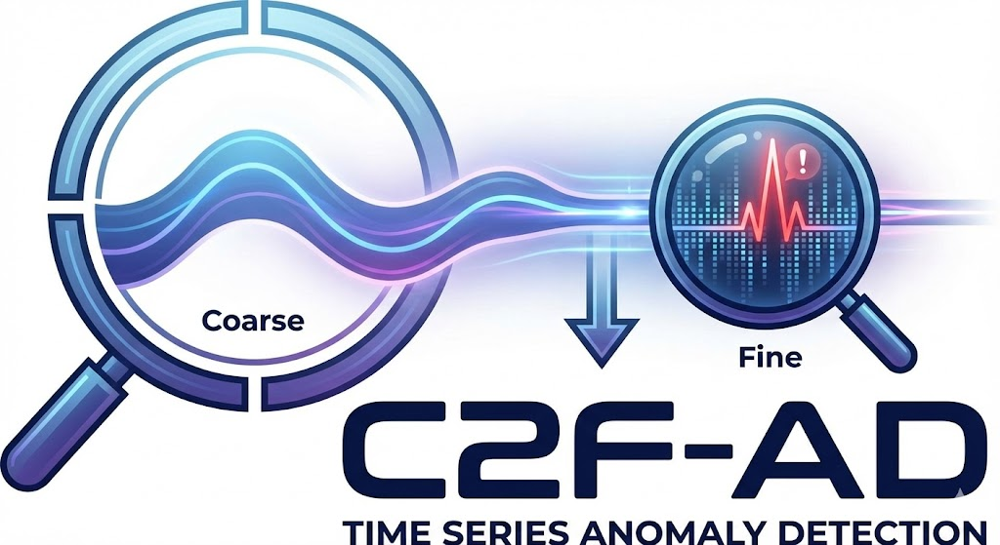
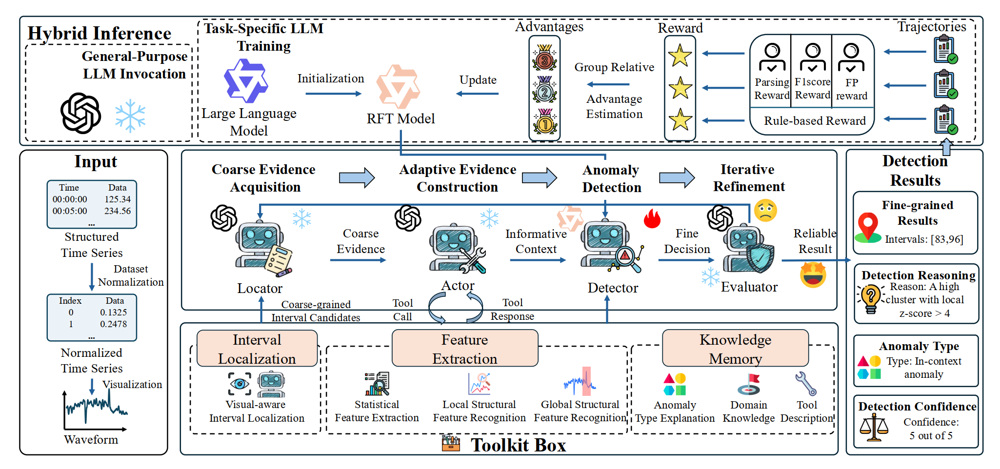
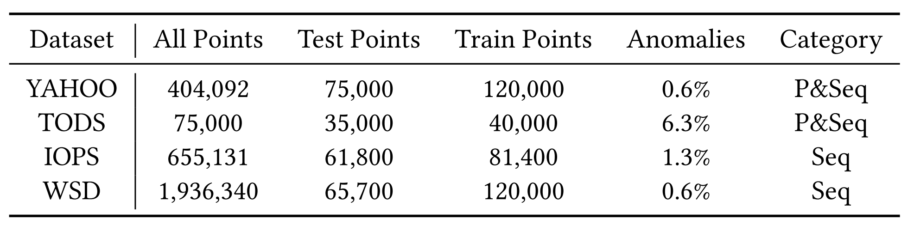
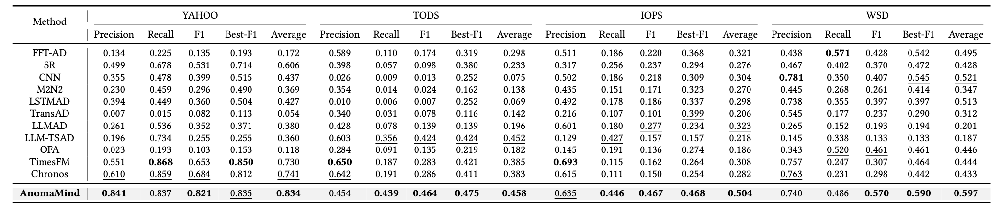
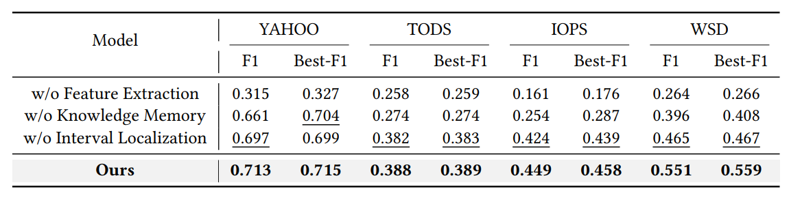
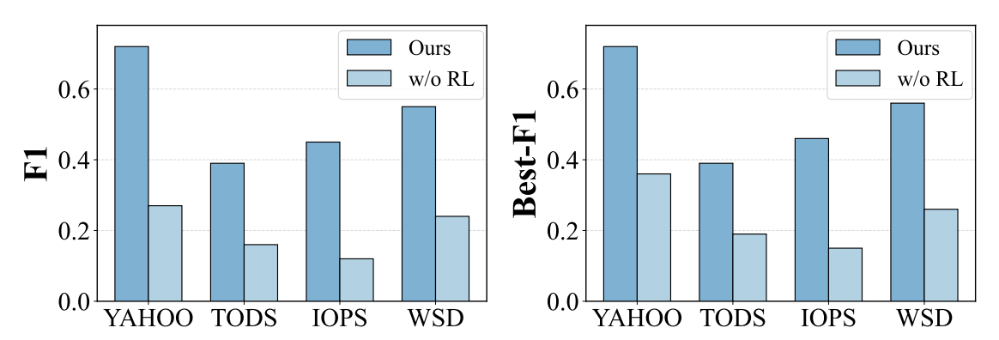
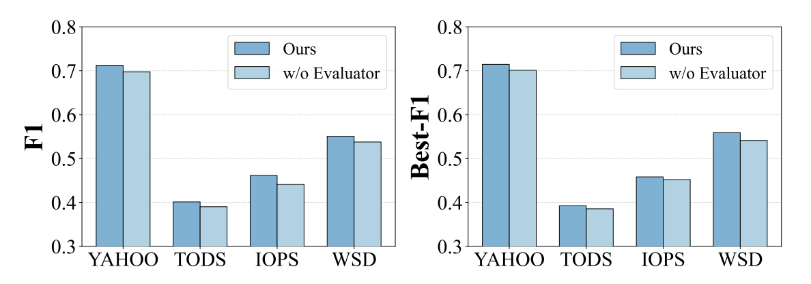

<div align="center">
  <h1>AnomaMind: Agentic Time Series Anomaly Detection with Tool-Augmented Reasoning</h1>
  <a href="./LICENSE">
    
  </a>
  <a href="https://github.com/Xiaoyu-Tao/AnomaMind-TS/stargazers">
    
  </a>
  <a href="https://github.com/Xiaoyu-Tao/AnomaMind-TS/pulls">
    
  </a>
</div>

---

AnomaMind is a novel framework that reformulates **Time Series Anomaly Detection (TSAD)** as an **evidence-driven sequential decision-making process**. It combines a structured coarse-to-fine workflow with tool-augmented reasoning and a hybrid inference mechanism that couples general-purpose LLM reasoning with task-specific anomaly decision learning via reinforcement learning.

> 📝 "AnomaMind: Agentic Time Series Anomaly Detection with Tool-Augmented Reasoning"  
> **Preprint** | [📄 Paper]()

---

## 🔍 Overview

Existing TSAD methods often treat anomaly detection as a static discriminative task with fixed feature inputs, lacking adaptive evidence gathering and iterative refinement. AnomaMind introduces an agentic paradigm:

- **Coarse-to-Fine Workflow**: Progressively localizes anomalous intervals (coarse evidence acquisition), then performs adaptive evidence construction, reasoning-based detection, and iterative refinement.
- **Tool-Augmented Reasoning**: Relies on a **Detection Toolkit**—interval localization (visual-aware), feature extraction (statistical and structural), and knowledge memory—for context-aware diagnostic analysis.
- **Hybrid Inference**: General-purpose LLMs handle autonomous tool invocation and self-reflective refinement; core anomaly detection decisions are learned through **reinforcement learning** under workflow-level feedback.

<p align="center">
  
</p>

---

## ✨ Key Features

- **Structured Coarse-to-Fine Workflow**: Coarse evidence acquisition → adaptive evidence construction → reasoning-based anomaly detection → iterative refinement.
- **Detection Toolkit**: Interval localization (VLM-based), statistical and structural feature extraction, and knowledge memory for domain and tool semantics.
- **Hybrid Decision Mechanism**: General-purpose models for tool orchestration and self-reflection; RL-optimized detector for precise anomaly boundaries.
- **Self-Reflective Refinement**: Evaluator validates intermediate results and triggers refinement when needed, reducing false alarms and improving consistency.
- **Strong Benchmark Performance**: Consistently improves over statistical, deep learning, foundation-model, and LLM-based baselines on YAHOO, TODS, IOPS, and WSD.

---

## 🚀 Getting Started

### 1. Clone the repo

```bash
git clone https://github.com/Xiaoyu-Tao/AnomaMind-TS
cd AnomaMind-TS
```

### 2. Environment Setup

```bash
conda create -n anomalmind python=3.10
conda activate anomalmind
sh install.sh
```

Create `scripts/.env` with your API config (required for batch_process and training):

```
LLM_API_KEY=your_api_key_here
LLM_BASE_URL=https://api.example.com/v1
AUX_LLM_MODEL=your_model_name
```

### 3. Prepare Data

AnomaMind is evaluated on four TSAD benchmarks with diverse anomaly types (point, contextual, collective, sequence):

<p align="center">
  
</p>

Please place the datasets in the `dataset` directory. Datasets and download links will be provided in the repository or paper.

```bash
mkdir -p dataset/raw
# Download datasets to ./dataset/raw
```

### 4. Run Anomaly Detection

**Step 1: Preprocess**

```bash
cd ./scripts
python preprocess.py ../dataset/raw ../dataset/processed --segment_size 100 --sample_ratio 1.0
```

**Step 2: Train**

```bash
python train_full_workflow.py --train_data ../dataset/processed --model Qwen/Qwen3-8B --output_dir ../model --epochs 2
```

**Step 3: Serve the trained model with vLLM**

```bash
# Replace the path with your checkpoint
vllm serve ./model/PATH/TO/HUGGINGFACE --port 8000 --max-model-len 11000 --gpu-memory-utilization 0.95 --enable-auto-tool-choice --tool-call-parser hermes
```

**Step 4: Batch inference**

```bash
python batch_process.py -i ../dataset/processed -o ../results -m Qwen/Qwen3-8B -u http://localhost:8000/v1 --enable_checking -w 4
```

**Step 5: Evaluate**

```bash
python eval.py --results_dir ../results --output ../evaluation_results.json
```

## 📊 Benchmark Results

**Main Results (F1 / Best-F1):**

AnomaMind achieves competitive or best average performance across Precision, Recall, F1, and Best-F1 on YAHOO, TODS, IOPS, and WSD, outperforming statistical (FFT-AD, SR), deep learning (CNN, M2N2, LSTMAD, TransAD), foundation (TimesFM, Chronos), and LLM-based (LLMAD, LLM-TSAD, OFA) baselines.

<p align="center">
  
</p>

**Ablation Studies:**

- **Detection tools**: Removing interval localization, feature extraction, or knowledge memory each degrades performance; feature extraction has the largest impact.
- **Workflow**: Removing the evaluator (iterative refinement) consistently hurts F1 and Best-F1 across datasets.
- **Reinforcement learning**: Removing RL for anomaly decision learning leads to substantial performance drop; RL is critical for task-specific decision boundaries.
<p align="center">
  
</p>

<p align="center">
  
  &emsp;
  
</p>

---

## 📁 Project Structure (Suggested)

```
AnomaMind-TS/
├── README.md
├── requirements.txt
├── dataset/           # Place benchmark data here
├── assets/            # Figures for README (main.png, ablation plots, etc.)
└── scripts/           # Run scripts for each benchmark
```


## 📜 License

This project is licensed under the MIT License — see the [LICENSE](LICENSE) file for details.


## 📜 License

This project is licensed under the MIT License — see the [LICENSE](LICENSE) file for details.
